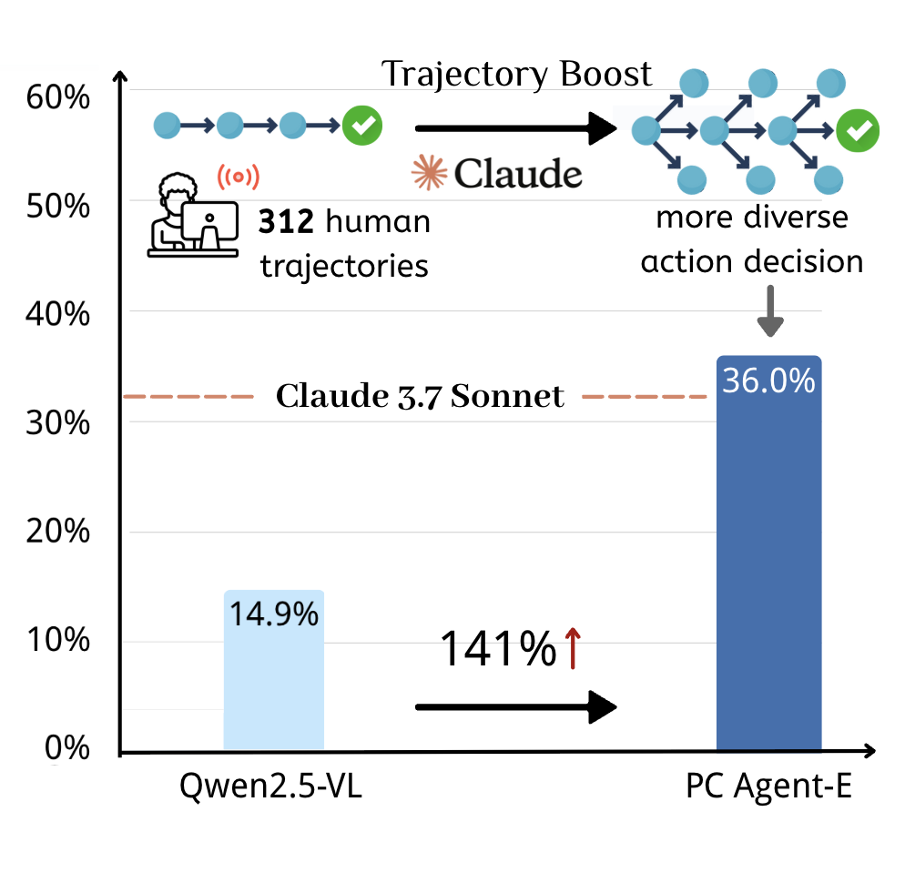
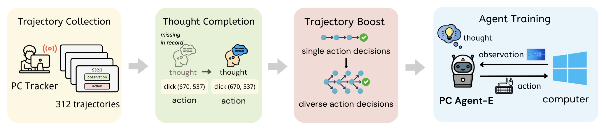

# Efficient Agent Training for Computer Use

<p align="center">
  📄 <a href="https://arxiv.org/abs/2505.13909" target="_blank">Paper</a> &nbsp; | &nbsp;
  🤖 <a href="https://huggingface.co/henryhe0123/PC-Agent-E" target="_blank">Model</a> &nbsp; | &nbsp;
  🤗 <a href="https://huggingface.co/datasets/henryhe0123/PC-Agent-E" target="_blank">Dataset</a>
</p>

<p align="center">
  
</p>

## Demo

Check out our demo of PC Agent-E autonomously controlling a computer to complete tasks on Windows and Linux systems!

https://github.com/user-attachments/assets/db24647b-620e-421f-8088-db858bb55ab8

https://github.com/user-attachments/assets/18b436e7-733f-49a5-8716-25c29a990766

## Introduction

We introduce **PC Agent-E**, an efficient agent training framework that elicits strong computer use capabilities with remarkable **data efficiency**. 
This framework is implemented with four key components: 
1. **Trajectory Collection**, gathering a small set of task trajectories from human annotators with [PC Tracker](https://github.com/GAIR-NLP/PC-Agent?tab=readme-ov-file#pc-tracker);
2. **Thought Completion**, reconstructing the latent human thought process before each action;
3. **Trajectory Boost**, synthesizing diverse alternative action decisions;
4. **Agent Training**, training native agent model with augmented trajectories.



## Quick Start

### Trajectory Boost

Collect raw human trajectory with PC Tracker. See usage [here](https://github.com/GAIR-NLP/PC-Agent?tab=readme-ov-file#pc-tracker).

### Post Processing

To convert raw human trajectory into high-quality trajectories for training, follow these steps:
1. Place recorded in the `data/` directory. 
2. Run post processing pipeline:
```bash
# Data refinement
python postprocess/refinement.py

# Thought completion and Trajectory Boost    
python postprocess/boost.py    
```

Note: You need to prepare your API key in advance.

### Agent Training

You can use [our dataset](https://huggingface.co/datasets/henryhe0123/PC-Agent-E) or build data set with above steps on your own. To prepare data for agent training, put the dataset in the `data/` directory, and run:
```bash
python postprocess/prepare.py 
```

We recommend using [LLaMA-Factory](https://github.com/hiyouga/LLaMA-Factory) for agent training. To launch distributed training across multiple nodes, you can run:

```bash
FORCE_TORCHRUN=1 NNODES=4 NODE_RANK=${PET_NODE_RANK} MASTER_ADDR=192.168.0.1 MASTER_PORT=29500 llamafactory-cli train train/sft.yaml
```

Replace PET_NODE_RANK with the rank of the current node (from 0 to 3).

### Agent Deployment

We provide a reference implementation of our PC Agent-E scaffold in the `deploy/` directory. To deploy our agent on your computer, run:

```bash
python deploy/main.py
```

Reference scripts for model deployment can be found in `scripts/server.sh`.

## Citation

If you find this work helpful, please consider citing:

```
@misc{he2025efficientagenttrainingcomputer,
      title={Efficient Agent Training for Computer Use}, 
      author={Yanheng He and Jiahe Jin and Pengfei Liu},
      year={2025},
      eprint={2505.13909},
      archivePrefix={arXiv},
      primaryClass={cs.AI},
      url={https://arxiv.org/abs/2505.13909}, 
}
```